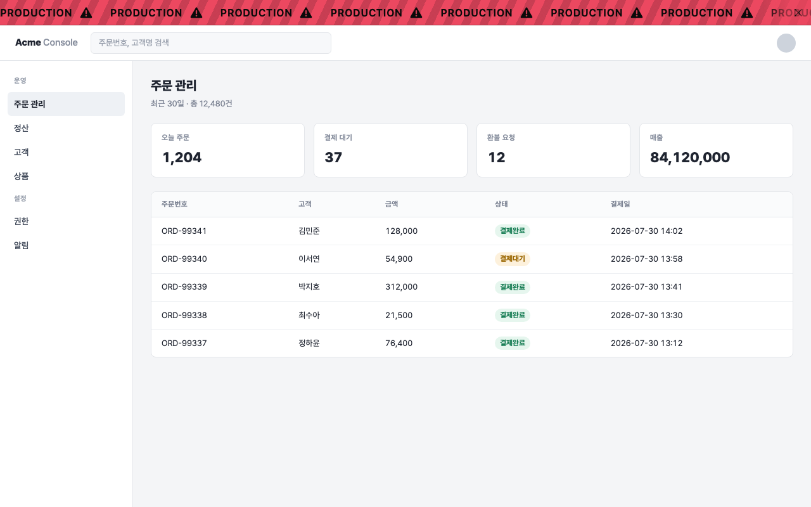

# Web Environment Banner

**English** · [한국어](README.ko.md)

A Chrome extension that puts a rolling banner at the top of any page whose URL you registered —
so you never mistake production for development.



- Register URLs per environment: local / development / production, plus anything you add
- Pick a background and text color per environment
- Tune height, font size, scroll speed and direction, spacing, diagonal stripes
- Rendered inside a Shadow DOM, so it never collides with the page's CSS
- Interface in English and Korean, switchable in the settings screen
- Collects no data and makes no network requests

## Install

Grab the ZIP from the [latest release](https://github.com/hahmjuntae/web-environment-banner/releases/latest)
and unzip it, then:

1. Open `chrome://extensions`
2. Turn on **Developer mode**
3. **Load unpacked** → select the unzipped folder

Defaults are ready to go — open `http://localhost:3000` and the banner appears.
Requires Chrome 88 or newer.

| Environment | Color | Default patterns |
|---|---|---|
| LOCAL | `#34b27c` | `localhost` `127.0.0.1` `0.0.0.0` `*.localhost` `local.*` `local-*` `*-local.*` |
| DEVELOPMENT | `#f5a312` | `dev.*` `dev-*` `*.dev.*` `*-dev.*` `stg.*` `*.stg.*` |
| PRODUCTION | `#ec4860` | *(empty — add your own)* |

## Usage

**Quick add** — on the site you want to tag, click the toolbar icon, pick a pattern and an
environment, then **Add**. The current tab updates immediately.

**Full settings** — **Settings** in the popup. Add, delete, and reorder environments, change colors
and banner style. Every change saves as you type. Each environment card carries a live preview.

**Preview without installing** — open `test/preview.html` in a browser.

## Pattern syntax

| Pattern | Matches | Does not match |
|---|---|---|
| `localhost` | `http://localhost:3000/app`, `https://localhost/` | `https://mylocalhost.com/` |
| `localhost:3000` | `http://localhost:3000/x` | `http://localhost:3001/x` |
| `dev.*` | `https://dev.example.com/` | `https://api.dev.example.com/` |
| `dev-*` | `https://dev-admin.example.com/` | `https://dev.example.com/` |
| `*-dev.*` | `https://api-dev.example.com/` | |
| `*.dev.example.com` | `api.dev.example.com`, `dev.example.com` | `dev.example.com.evil.io` |
| `example.com/admin/*` | `http://example.com/admin/users` | `http://example.com/` |
| `https://example.com/admin/*` | https only | `http://example.com/admin/users` |
| `/^https:\/\/\w+\.corp\./` | wrap in slashes for a raw regular expression | |

- Omit the scheme to match any scheme; omit the port to match any port.
- Omit the path to match every path on that host.
- A `*` in the host position respects dot and hyphen boundaries: `dev.*` only matches hosts starting
  with `dev.`, `dev-*` only those starting with `dev-`.
- **A trailing `*` is open-ended.** `dev.*` also matches `dev.example.com.other.io`. Spell the host
  out (`*.dev.example.com`) to bound it.
- When several environments match, the one **higher in the settings list** wins. Reorder with `↑` `↓`.

## How the banner avoids covering the page

The banner is `position: fixed`, so two things move the page out of its way:

| Option | Target | Method |
|---|---|---|
| Push page content | normal document flow | `padding-top` on `<html>`, equal to the banner height |
| Offset fixed headers | the site's own `fixed` / `sticky` header | finds elements overlapping the banner and adds the banner height to their `top` |

The second one exists because `fixed` and `sticky` elements sit outside the document flow and padding
cannot move them. Only the point right below the banner is probed with `elementsFromPoint`, so no full
DOM walk happens. Elements taller than 260px (modals, full-screen overlays) are left alone, and the
original inline values are restored when the banner is closed or the option is turned off.

If a site adjusts its header's `top` on scroll, the two can fight. Turn this option off in that case.

## Share with a team

**Export** in the settings screen writes a JSON file; **Import** reads it back. Settings also live in
`chrome.storage.sync`, so they follow you across Chrome instances signed in to the same Google account.

## Development

```
manifest.json               MV3 manifest
_locales/{en,ko}/           store-facing name and description (English is the default locale)
assets/icon*.png            toolbar and store icons (icon.svg / icon-small.svg are the sources)
assets/fonts/               bundled Pretendard + license
src/lib/messages.js         UI string catalog (en / ko)
src/lib/i18n.js             locale helper — auto / en / ko
src/lib/icons.js            inline SVG (mark + lucide-style line icons)
src/lib/font.js             registers the bundled font on document.fonts
src/lib/defaults.js         default settings and color presets
src/lib/match.js            URL pattern → RegExp
src/lib/store.js            chrome.storage.sync wrapper + normalization
src/lib/banner.js           banner renderer (Shadow DOM, marquee sizing)
src/content/content.js      injection + content and fixed-header offsets
src/options/                settings screen
src/popup/                  toolbar popup
```

```bash
node test/match.test.js    # pattern matching — 43 pattern + 14 environment cases
open test/harness.html     # injection, positioning, header offset, restore — 22 checks
open test/preview.html     # visual check without installing
bash store/package.sh      # build dist/ ZIP (validates manifest, syntax, locales)
bash store/make-assets.sh  # regenerate store screenshots and promo tile
```

Privacy policy: [PRIVACY.md](PRIVACY.md).

## Design

The UI follows a monochrome, zero-radius system: `#1d1d1d` canvas, `#f5f5f5` ink, `#2e2e2e` hairlines,
borders instead of shadows, and semantic color reserved for state (`#34b27c` `#f5a312` `#ec4860`
`#3d8bf5`). Type is Pretendard throughout.

## Limitations

- Works on `http` and `https` pages only; `file://` is excluded to keep the permission scope minimal.
- No banner on `chrome://`, `chrome-extension://`, or the Chrome Web Store — extensions cannot run there.
- Not drawn inside iframes (top frame only).
- On sites built around `100vh`, pushing content can add a scrollbar the height of the banner.
- SPA route changes are picked up by a 1-second poll, since an isolated content script cannot observe
  history events directly.
- The close button hides the banner for that tab only; it returns in a new tab.

## License

MIT — see [LICENSE](LICENSE). Bundled Pretendard is under the SIL Open Font License 1.1.
